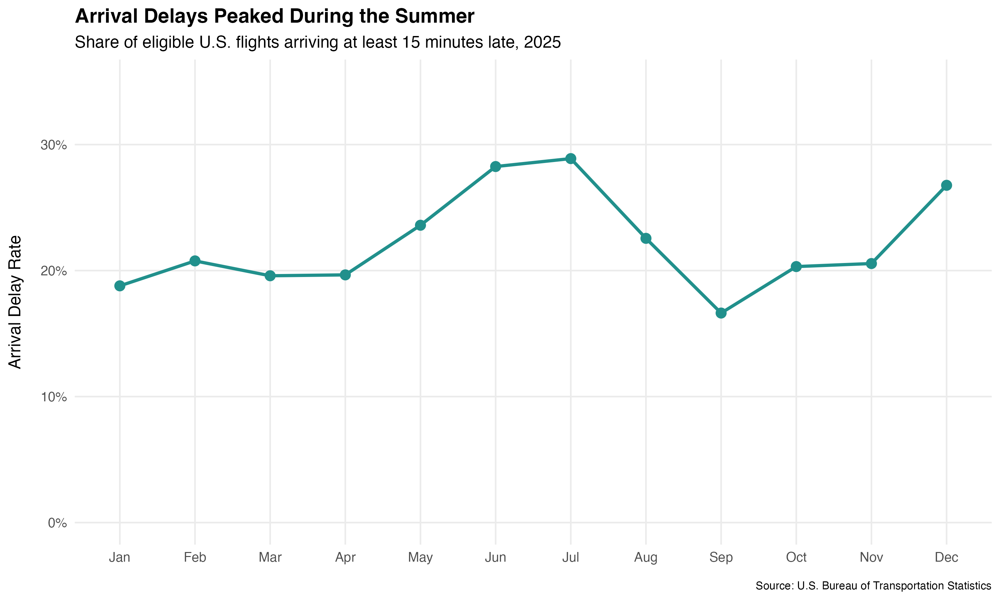
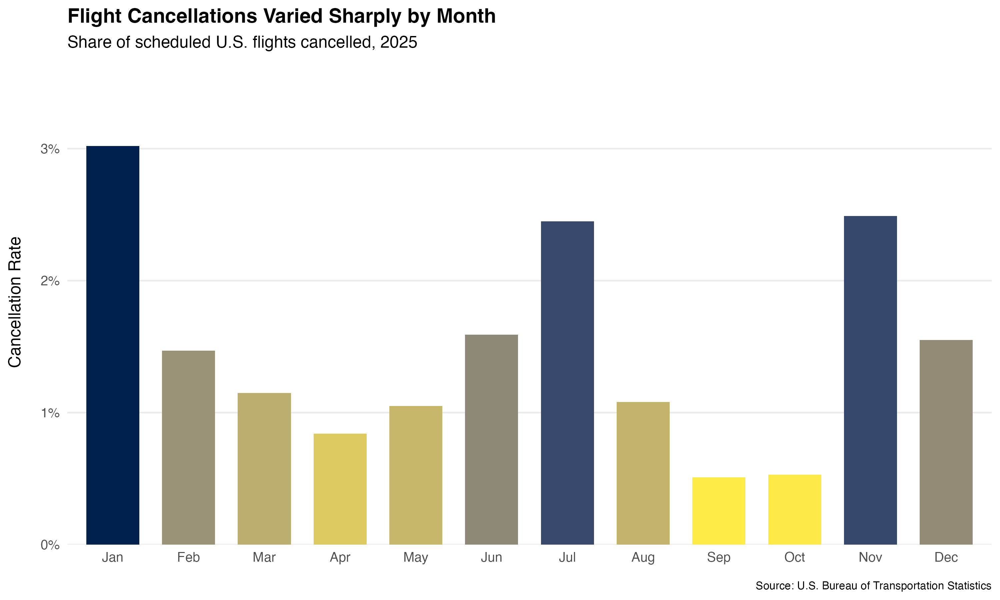
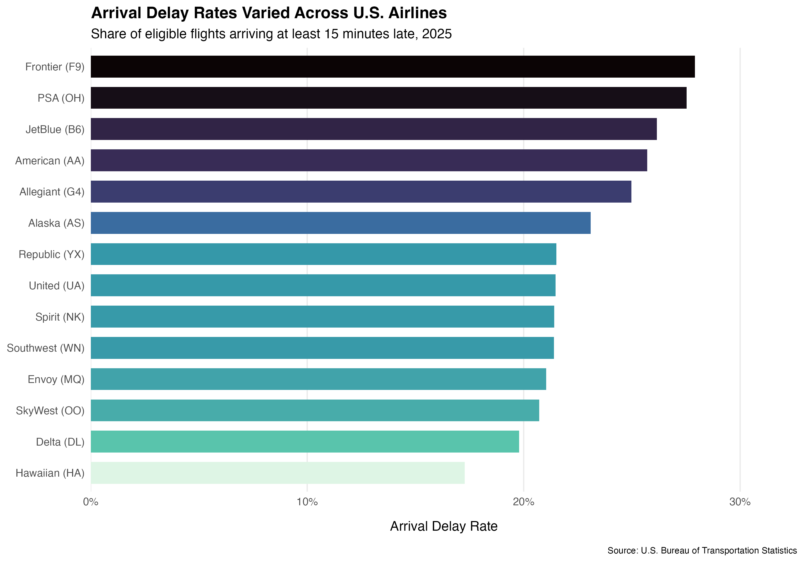
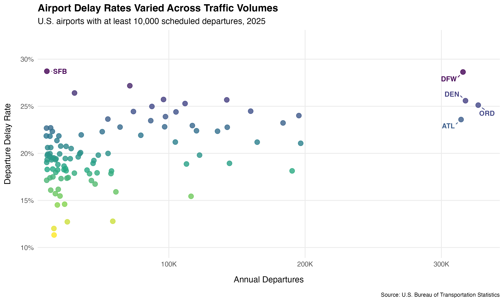
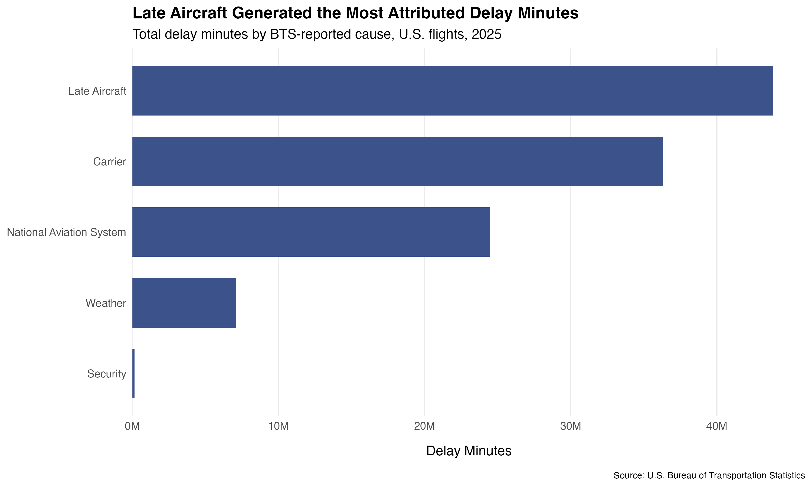
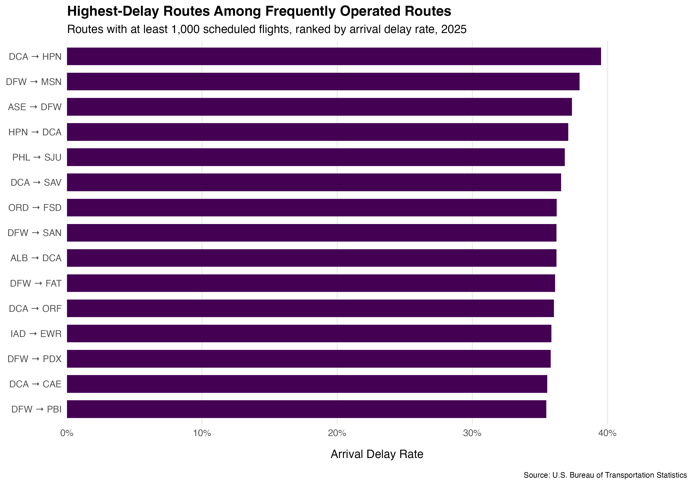

```{r}
#| lebel: setup
#| include: false

library(tidyverse)
library(here)

analysis_dir <- here(
    "data",
    "processed",
    "analysis"
)

overlall_performance <- read_csv(
    file.path(analysis_dir, "monthly_performance.csv"),
    show_col_types = FALSE
)

airline_performance <- read_csv(
  file.path(analysis_dir, "airline_performance.csv"),
  show_col_types = FALSE
)

airport_performance <- read_csv(
  file.path(analysis_dir, "airport_performance.csv"),
  show_col_types = FALSE
)

delay_causes <- read_csv(
  file.path(analysis_dir, "delay_causes.csv"),
  show_col_types = FALSE
)

route_performance <- read_csv(
  file.path(analysis_dir, "route_performance.csv"),
  show_col_types = FALSE
)
```

# Executive Summary

This analysis examines 7.0 million U.S. scheduled passenger flights reported by the U.S. Bureau of Transportation Statistics during 2025. The analysis evaluates when operational disruptions occurred, where they were concentrated, and which reported factors accounted for the greatest share of delay minutes.

Across the year, 22.31% of eligible flights arrived at least 15 minutes late, while 1.47% of scheduled flights were cancelled. The average arrival delay among completed, non-diverted flights was 8.5 minutes, although the median flight arrived 6 minutes early, indicating that a smaller number of substantial delays pulled the average upward.

Several patterns stand out:

- **Delays showed strong seasonality.** The arrival delay rate reached 28.89% in July and 28.26% in June, compared with a yearly low of 16.63% in September.
- **Cancellations followed a different seasonal pattern.** January recorded the highest cancellation rate at 3.02%, while September and October were both near 0.5%.
- **Performance varied materially across operating carriers.** Arrival delay rates ranged from 17.28% to 27.91% among the carriers represented in the dataset.
- **Operational disruption was unevenly distributed across the network.** Airport delay rates varied considerably across traffic volumes, while several frequently operated routes recorded arrival delay rates above 35%.
- **Late-aircraft and carrier delays dominated attributed delay minutes.** Together, these categories represented approximately 72% of the delay minutes assigned to the five BTS delay categories.

The results show that operational disruption was concentrated unevenly across time, carriers, airports, and routes. The analysis describes observed performance and does not by itself establish the causes of differences between operators or markets.

# Project Overview

## Objective

This project evaluates operational performance across the U.S. airline network during 2025. The analysis focuses on several questions:

- How did flight delays and cancellations change throughout the year?
- How did arrival-delay performance vary across operating carriers?
- How did departure-delay rates vary among higher-volume U.S. airports?
- Which reported causes accounted for the greatest number of delay minutes?
- Which frequently operated routes experienced the highest arrival-delay rates?

The analysis emphasizes both the frequency and scale of operational disruption rather than relying on a single performance measure.

## Data Source

The project uses 2025 **On-Time Performance** data published by the U.S. Bureau of Transportation Statistics (BTS).

Twelve monthly files covering January through December 2025 were combined into a single annual dataset containing:

- **7,001,619 flight records**
- **45 variables**
- **12 months of operations**

The dataset contains scheduled and actual departure and arrival information, delays, cancellations, diversions, flight distances, airport and carrier identifiers, and BTS-reported delay categories.

# Methodology

## Data Preparation

The twelve monthly BTS files were downloaded and processed through a reproducible R pipeline.

During preprocessing:

- monthly files were combined into a single annual dataset;
- column names were standardized to `snake_case`;
- flight dates were converted to a date data type;
- selected cancellation, diversion, and delay indicators were standardized for analysis;
- key fields were checked for missing values;
- exact duplicate records were checked; and
- coverage across all twelve months was verified.

The resulting dataset contained **7,001,619 rows and 45 columns**, with no exact duplicate records and no missing values in the flight date, carrier, origin, destination, or distance fields.

Because the complete dataset is relatively large, the cleaned annual dataset was stored in **Parquet format** and queried using **DuckDB** rather than repeatedly loading the full dataset into R memory.

## Analytical Approach

Performance was evaluated using several complementary measures.

An **arrival delay** is defined using the BTS arrival-delay indicator for flights arriving at least 15 minutes late. The arrival-delay rate is calculated among completed, non-diverted flights with an applicable arrival-delay observation.

The **cancellation rate** is calculated as cancelled flights divided by all scheduled flight records.

Average and median arrival delays are calculated for completed, non-diverted flights. Negative arrival-delay values are retained because they represent flights arriving ahead of schedule.

For airport comparisons, the analysis includes airports with at least **10,000 scheduled departures** during 2025. This threshold reduces the influence of airports with relatively small numbers of observations.

For route comparisons, the analysis includes directional routes with at least **1,000 scheduled flights** during the year. Routes are treated directionally, meaning that, for example, `DCA → HPN` and `HPN → DCA` are analyzed separately.

## Analytical Workflow

The project uses a staged workflow:

1. **Import and cleaning** — raw BTS monthly files are validated, standardized, and combined.
2. **Storage** — the cleaned annual dataset is stored in Parquet format.
3. **Analysis** — DuckDB queries aggregate the flight-level dataset into analytical summary tables.
4. **Visualization** — R and ggplot2 transform the analytical outputs into report-ready figures.
5. **Reporting** — Quarto integrates the methodology, findings, and visualizations into the final report.

This structure separates data preparation, analysis, visualization, and reporting while avoiding repeated processing of the full flight-level dataset.

# National Performance

Across 2025, the dataset contains **7,001,619 scheduled flights**. Of these, **102,876 flights were cancelled** and **19,258 were diverted**.

Among eligible completed flights, **22.31% arrived at least 15 minutes late**. The average arrival delay was **8.5 minutes**, while the median was **−6 minutes**. The substantial difference between the mean and median is consistent with a right-skewed arrival-delay distribution, in which relatively large positive delays pull the mean upward.

## Monthly Arrival Delays

Arrival-delay performance varied considerably throughout the year.

{fig-alt="Monthly U.S. arrival delay rate during 2025." width=90%}

The arrival-delay rate increased from **19.66% in April to 23.60% in May**, followed by a sharper increase to **28.26% in June**. The annual peak occurred in **July at 28.89%**.

Performance improved during August and reached the annual low in **September, when 16.63% of eligible flights arrived at least 15 minutes late**. Delay rates subsequently increased, reaching **26.77% in December**.

Average arrival delays followed a similar pattern. July recorded the highest monthly average at **17.35 minutes**, compared with only **2.32 minutes in September**.

The median arrival delay remained negative in every month, ranging from −8 minutes to −3 minutes. Even during June, July, and December—months with relatively high average delays—the median completed flight still arrived ahead of schedule. This contrast highlights the influence of substantially delayed flights on monthly averages.

## Monthly Cancellations

Cancellation rates followed a different pattern from arrival delays.

{fig-alt="Monthly U.S. flight cancellation rate during 2025." width=90%}

**January recorded the highest cancellation rate at 3.02%**, even though its arrival-delay rate of 18.79% was below the annual average. Cancellation rates subsequently declined, reaching **0.51% in September** and **0.53% in October**.

A second increase occurred in **November, when 2.49% of scheduled flights were cancelled**, before the rate declined to 1.55% in December.

The differing monthly patterns suggest that arrival delays and cancellations capture distinct dimensions of operational disruption. Months with the highest delay rates were not necessarily the months with the highest cancellation rates.

# Airline Performance

Arrival-delay performance varied considerably across the 14 operating carriers represented in the 2025 dataset.

{fig-alt="Arrival delay rates by U.S. airline during 2025." width=90%}

**Frontier (F9) recorded the highest arrival-delay rate at 27.91%**, followed by **PSA Airlines (OH) at 27.53%** and **JetBlue (B6) at 26.15%**. American Airlines (AA), which operated 973,653 flights in the dataset, recorded an arrival-delay rate of **25.71%**.

At the other end of the observed range, **Hawaiian Airlines (HA) recorded an arrival-delay rate of 17.28%**, followed by **Delta Air Lines (DL) at 19.79%**. Hawaiian Airlines (HA) recorded the lowest arrival-delay rate at 17.28%, followed by Delta Air Lines (DL) at 19.79%. Delta operated 1,026,332 scheduled flights during the year.

Southwest Airlines (WN) accounted for the largest number of scheduled flights in the dataset, with approximately **1.39 million flights**, and recorded an arrival-delay rate of **21.40%**.

Cancellation performance did not follow the same ordering as arrival delays. **PSA Airlines recorded the highest cancellation rate at 4.58%**, while several carriers with relatively high arrival-delay rates had substantially lower cancellation rates.

These comparisons represent observed operational outcomes rather than controlled measures of airline performance. Airlines operate different route networks, aircraft schedules, airport mixes, geographic regions, and business models. Exposure to congestion, weather, and other operational conditions therefore differs across carriers. These results provide descriptive comparisons of observed 2025 operations. They do not isolate the effect of the carrier itself from differences in route networks, airport exposure, geography, scheduling, or other operating conditions.

# Airport Performance

Airport-level performance was evaluated across 103 airports with at least 10,000 scheduled departures during 2025. Applying a minimum-volume threshold provides a more meaningful comparison by limiting the influence of airports with relatively small numbers of observations.

{fig-alt="Relationship between annual departures and departure delay rates at U.S. airports during 2025." width=90%}

Departure-delay rates varied substantially across airports and did not increase uniformly with traffic volume.

Among the airports included in the analysis, **Orlando Sanford International (SFB) recorded the highest departure-delay rate at 28.72%**, based on 10,495 scheduled departures. **Dallas/Fort Worth International (DFW) followed closely at 28.64%**, despite operating at a much larger scale with 315,854 departures.

Several other high-volume airports also recorded elevated delay rates. **Denver International (DEN)** had a departure-delay rate of **25.59% across 317,686 departures**, while **Chicago O'Hare (ORD)** recorded **25.12% across 327,028 departures**.

The scatter plot illustrates the distinction between delay rate and operational scale. SFB and DFW recorded nearly identical departure-delay rates, yet DFW operated approximately 30 times as many scheduled departures. Similar percentages can therefore represent substantially different numbers of delayed flight operations.

The broader distribution shows that traffic volume alone does not account for the observed variation in departure-delay rates. Airports with similar annual departure volumes can occupy substantially different positions on the delay-rate axis. Factors such as network structure, runway capacity, airspace congestion, weather exposure, airline scheduling, and connecting traffic may contribute to these differences, but their individual effects are not estimated in this analysis.

# Sources of Delay

BTS reports five categories of delay attribution: carrier, weather, National Aviation System (NAS), security, and late-arriving aircraft. Across the 2025 dataset, these categories accounted for more than **111.9 million attributed delay minutes**.

{fig-alt="Total attributed delay minutes by reported cause during 2025." width=90%}

**Late-arriving aircraft represented the largest category, accounting for approximately 43.9 million delay minutes, or 39.2% of the total attributed minutes.** Carrier delays were the second-largest category at approximately **36.3 million minutes (32.5%)**.

National Aviation System delays accounted for approximately **24.5 million minutes (21.9%)**, while weather accounted for approximately **7.1 million minutes (6.4%)**. Security delays were comparatively rare, totaling approximately **153,000 minutes (0.14%)**.

Late-aircraft and carrier delays together accounted for approximately **72% of all attributed delay minutes** in the five reported categories. Late-aircraft delays also reflect the potential for disruption to propagate through an airline's operating schedule: a delayed inbound aircraft can contribute to a subsequent flight departing or arriving late.

These categories require careful interpretation. BTS delay attribution follows specific reporting definitions, and the categories should not be treated as completely independent causal mechanisms. Weather, for example, can affect the National Aviation System or disrupt an aircraft's earlier flights, which may later appear as a late-aircraft delay. The figures therefore describe how delay minutes were **reported and attributed in the BTS data**, rather than the complete underlying causal chain of each disruption.

# Route Performance

Route-level performance was evaluated across **2,342 directional routes with at least 1,000 scheduled flights during 2025**. Each direction is analyzed separately because operational performance may differ between the two directions of the same airport pair.

{fig-alt="Highest arrival delay rates among frequently operated directional U.S. routes during 2025." width=90%}

Among qualifying routes, **DCA → HPN recorded the highest arrival-delay rate at 39.52%**, based on 1,359 scheduled flights. The reverse route, **HPN → DCA, also appeared among the highest-delay routes at 37.10%**.

Routes involving **Dallas/Fort Worth (DFW)** and **Washington National (DCA)** appeared repeatedly among the 15 highest arrival-delay rates. Five DFW-origin routes and three DCA-origin routes were represented, suggesting that the highest-delay observations were not confined to isolated airport pairs.

Delay frequency alone does not capture the full extent of disruption. **ASE → DFW recorded a 37.37% arrival-delay rate, an average arrival delay of 32.44 minutes, and a 7.47% cancellation rate**. Its average arrival delay was the highest among the 15 routes shown.

Cancellation rates were also elevated on several routes in the figure. **DCA → CAE recorded the highest cancellation rate among the 15 routes at 7.76%**, followed closely by DCA → HPN at 7.73% and ASE → DFW at 7.47%.

These results identify routes with unusually high observed disruption among frequently operated services, but they do not establish why those routes performed differently. Route-level outcomes can reflect airport congestion, regional weather, schedule design, aircraft utilization, airspace constraints, and carrier-specific network operations.

# Key Findings and Limitations

## Key Findings

The analysis identifies several broader patterns across U.S. airline operations in 2025:

- **Operational disruption varied substantially throughout the year.** Arrival delays peaked during the summer and increased again in December, while cancellations followed a different seasonal pattern.
- **No single performance measure captured operational disruption.** Delay rates, cancellation rates, average delays, and operational volume provided different perspectives across carriers, airports, and routes.
- **Performance varied substantially across the network.** National averages concealed meaningful differences among carriers, airports, and frequently operated routes.
- **Late-aircraft and carrier delays dominated reported delay attribution.** Together, they accounted for approximately 72% of the 111.9 million delay minutes attributed across the five BTS categories.
- **Operational scale provided important context for rate-based comparisons.** Similar delay percentages could represent very different numbers of affected flights depending on the volume of operations.

Overall, the analysis demonstrates the value of examining airline performance across multiple levels of aggregation rather than relying on a single national metric.

## Limitations

Several limitations should be considered when interpreting the results.

**The analysis is descriptive rather than causal.** Differences between carriers, airports, and routes may reflect network structure, geography, weather exposure, airport congestion, schedule design, aircraft utilization, and other factors that are not independently controlled in this analysis.

**Carrier comparisons are not adjusted for operating environment.** Airlines serve different airports, routes, regions, and passenger markets. Observed differences therefore should not be interpreted as isolated measures of carrier quality.

**Airport and route thresholds intentionally exclude lower-volume operations.** Airport analysis is limited to locations with at least 10,000 annual departures, while route analysis requires at least 1,000 annual scheduled flights. These thresholds improve comparability but mean the findings do not describe every airport or route in the BTS dataset.

**Delay-cause categories reflect BTS reporting conventions.** Carrier, weather, NAS, security, and late-aircraft delays can interact operationally and should not be interpreted as completely independent causal categories.

**The study covers a single calendar year.** The results describe conditions observed during 2025 and do not establish whether the identified patterns persist across years. Multi-year data would be required to evaluate longer-term trends and distinguish recurring seasonal patterns from conditions specific to 2025.

These limitations define opportunities for further analysis, including multi-year trend analysis, seasonal comparisons across years, route-level carrier controls, airport congestion measures, and more detailed modeling of the factors associated with flight disruption.

# Technical Notes

## Tools and Technologies

The project was developed in R using a reproducible analytical workflow. Primary tools include:

- **R** as the primary analytical environment for data preparation, analysis, and visualization
- **tidyverse** for data transformation and manipulation
- **DuckDB** for SQL-based analytical queries against the 7-million-row processed dataset
- **Parquet** for efficient columnar storage of the cleaned flight-level data
- **ggplot2** and **viridis** for data visualization
- **Quarto** for analytical reporting
- **Git and GitHub** for version control and project documentation

## Project Structure

The core analytical components of the repository are organized as follows:

```text
us-airline-performance-analysis/
├── R/
│   ├── 01_import_clean.R
│   ├── 02_analysis.R
│   └── 03_visualizations.R
├── data/
│   ├── raw/
│   └── processed/
│       └── analysis/
├── figures/
├── README.md
└── report.qmd
```

`01_import_clean.R` validates and combines the monthly BTS source files, standardizes selected fields, and writes the cleaned annual dataset to Parquet.

`02_analysis.R` queries the processed Parquet dataset with DuckDB and generates reusable summary tables for national, carrier, airport, delay-cause, and route analysis.

`03_visualizations.R` reads the analytical summary tables and generates report-ready figures without reprocessing the full flight-level dataset.

`report.qmd` integrates the methodology, findings, and visualizations into the final analytical report.

## Reproducibility

The project intentionally separates source data, processed data, analysis, visualization, and reporting. Generated analytical outputs are excluded from version control where appropriate and can be regenerated through the project scripts once the required BTS source data are available.

The workflow is executed sequentially:

```bash
Rscript R/01_import_clean.R
Rscript R/02_analysis.R
Rscript R/03_visualizations.R
quarto render report.qmd
```

This design reduces unnecessary processing during visualization and reporting. Once the analytical summary tables have been generated, figures and report content can be developed without repeatedly querying the complete flight-level dataset.